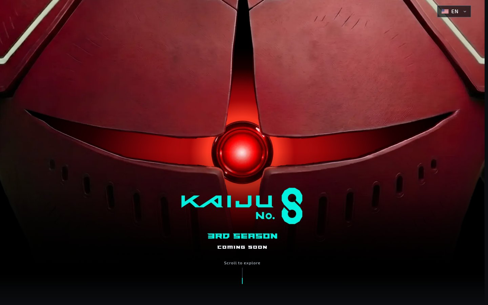
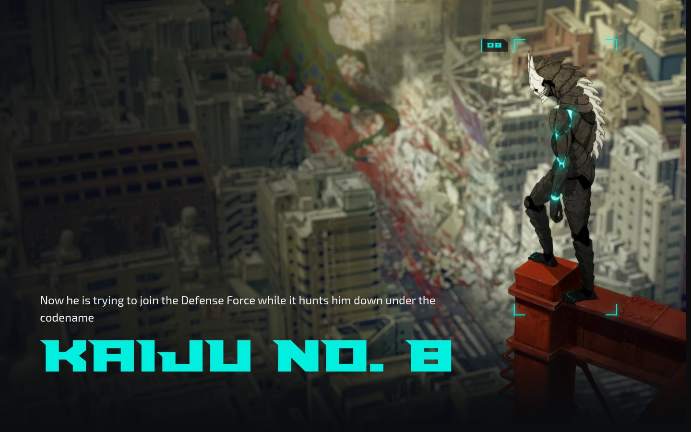
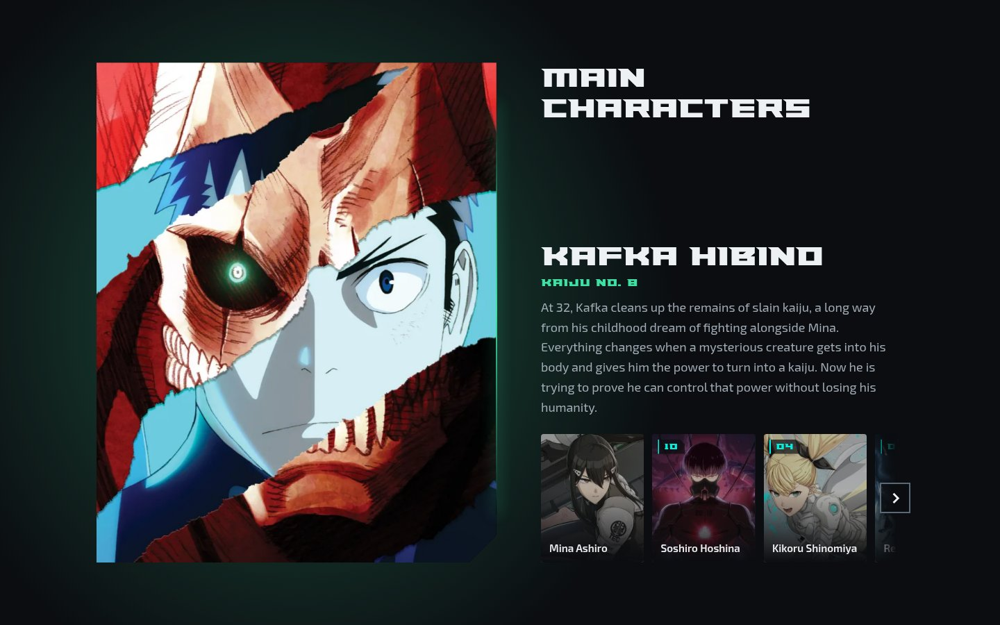
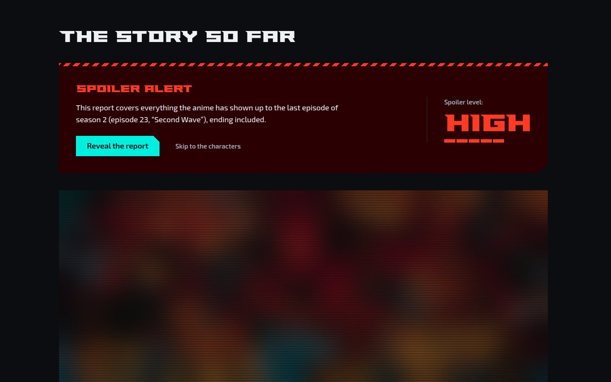
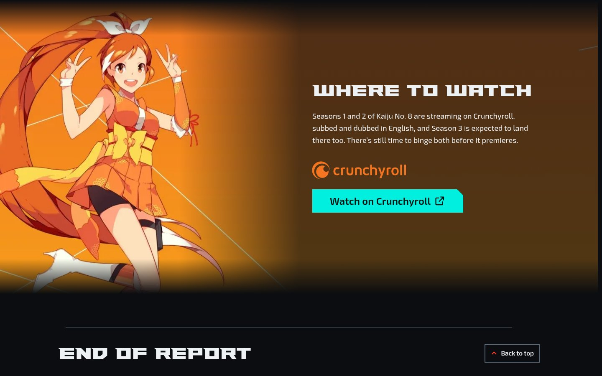
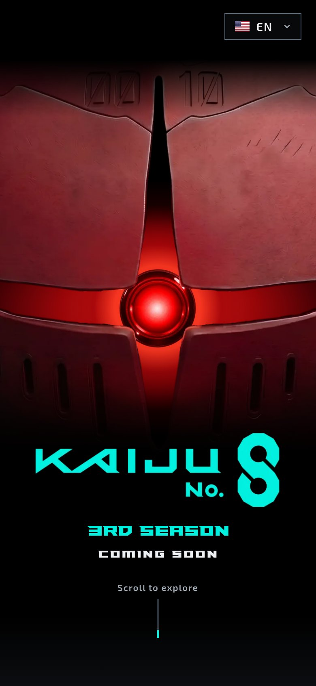
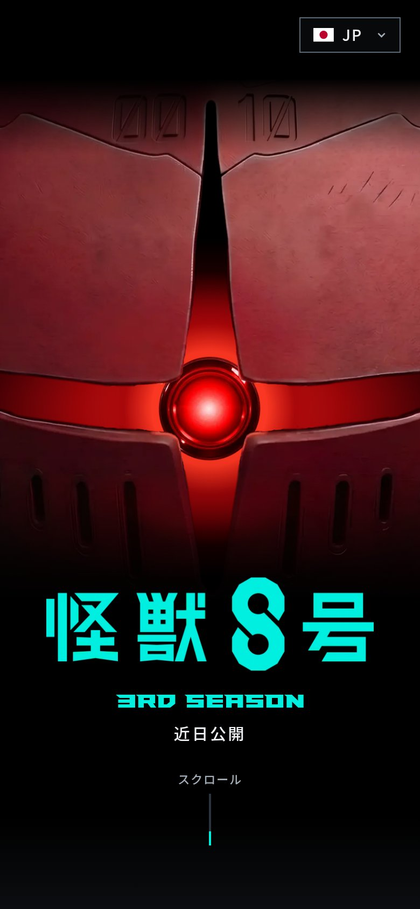

<div align="center">

# Kaiju No. 8 · Season 3 fan teaser

An unofficial, non-profit one-page teaser for the third season of the Kaiju No. 8 anime,<br />
in Brazilian Portuguese, English and Japanese.




</div>

## About

Kaiju No. 8 season 3 is on the way, and this site gets you ready for it in a single scroll: what the
series is about, what happened in the first two seasons, who the main characters are, the trailer
and where to watch it.

It is a static site with no backend, no API calls and no CMS. Each language is its own prerendered
route (`/pt-BR/`, `/en/`, `/ja/`), and the root sends visitors to the right one based on their
saved choice or browser language.

## Goal

Build a fan page that looks like it belongs to the show and gets the technical details right:

- **No visible loading glitches.** A preloader covers the page until the route's fonts and the
  first images are ready, so nothing swaps or jumps after it opens.
- **Accessible.** Keyboard and screen reader friendly, with a reduced motion version of every
  animation and text contrast checked against WCAG AA.
- **Works without JavaScript.** All content is in the HTML; motion is added on top.
- **Three languages, done properly.** Separate routes, `hreflang`, a localized share image and 404
  page for each language, and no text swapped by script after paint.
- **Secure by default.** A strict Content Security Policy built from hashes of the final HTML.

## Tour

<table>
  <tr>
    <td width="50%"></td>
    <td width="50%"></td>
  </tr>
  <tr>
    <td><b>What it is</b>: the premise told in scroll-driven beats while a camera pans over the art and locks onto Kaiju No. 8.</td>
    <td><b>Main characters</b>: a spotlight panel with a crossfade, plus a carousel of seven characters.</td>
  </tr>
  <tr>
    <td></td>
    <td></td>
  </tr>
  <tr>
    <td><b>The story so far</b>: a spoiler report up to the season 2 finale, hidden behind an accessible spoiler gate.</td>
    <td><b>Where to watch</b>: Crunchyroll in Portuguese and English, the official streaming page in Japanese.</td>
  </tr>
</table>

<p align="center">
  
  &nbsp;&nbsp;
  
</p>

## Sections

| Section              | What's there                                                                                      |
| -------------------- | ------------------------------------------------------------------------------------------------- |
| **Hero**             | The Numbers armor, with a red eye that lights up on load and follows the cursor on desktop        |
| **What it is**       | Premise in five beats over a pinned artwork, the author's file, sales numbers and season timeline |
| **The story so far** | Recap up to episode 23 of season 2: dossier, timeline of the waves, five fronts and the finale    |
| **Main characters**  | Spotlight panel and carousel, each character lit in their own aura color                          |
| **Trailer**          | YouTube facade: nothing from YouTube loads until you press play                                   |
| **Where to watch**   | Link to the streaming service for each language                                                   |
| **Footer**           | "End of report" HUD line, legal disclaimer, credits and language links                            |
| **404**              | One page per language, no JavaScript                                                              |

## Stack

| Layer     | Tools                                                                                     |
| --------- | ----------------------------------------------------------------------------------------- |
| Framework | [Astro 7](https://astro.build) with static output                                         |
| Language  | TypeScript 6 with the `strictest` config                                                  |
| Styling   | Plain CSS with custom properties, cascade layers and BEM                                  |
| Motion    | [GSAP 3](https://gsap.com) and ScrollTrigger                                              |
| Fonts     | Paladins, Exo 2 and a Noto Sans JP subset, with metric-matched fallbacks from Fontaine    |
| Images    | `astro:assets` for responsive images; sharp for favicons and share images                 |
| Quality   | ESLint 10 (typescript-eslint, Astro, jsx-a11y, CSS, file naming, local rules), Prettier 3 |
| Hosting   | Any static host; `_headers` (CSP and security headers) for Cloudflare Pages or Netlify    |

## Getting started

You need Node 24 (see `.nvmrc`). Astro 7 does not run on Node 20.

```bash
nvm use
npm install
npm run dev
```

Open http://localhost:4321. The root redirects to `/pt-BR/`, `/en/` or `/ja/`.

## Scripts

| Script                       | What it does                                                     |
| ---------------------------- | ---------------------------------------------------------------- |
| `npm run dev`                | development server                                               |
| `npm run build`              | type check and static build in `dist/`, including `_headers`     |
| `npm run preview`            | serves `dist/` (without the `_headers` rules)                    |
| `npm run validate`           | Prettier check, ESLint and `astro check`                         |
| `npm run lint:fix`           | fixes lint issues                                                |
| `npm run format`             | formats every file with Prettier                                 |
| `npm run subset-fonts`       | rebuilds the Noto Sans JP subset; run it after editing `ja.json` |
| `npm run generate-favicons`  | writes the favicons and manifest icons to `public/`              |
| `npm run generate-og-images` | writes the social sharing images to `public/og/`                 |

## Project structure

```text
src/
  pages/        one dynamic [locale] route, the language redirect and the 404 pages
  components/   one folder per component (.astro, .css, .client.ts, .types.ts)
  layouts/      page shell with preloader, header and skip link; 404 shell
  i18n/         locale config and the pt-BR, en and ja dictionaries
  lib/          browser and build logic per section, motion helpers, images
  seo/          metadata, JSON-LD, web manifest and robots.txt
  styles/       reset, design tokens, fonts and utilities
tooling/        Astro integrations (CSP headers, 404 pages, font checks) and ESLint rules
scripts/        font subset, favicons and share images
```

## Deployment

`npm run build` writes the site to `dist/`, along with `dist/_headers` (CSP and security headers in
the Cloudflare Pages and Netlify format). On Cloudflare Pages each language also gets its own 404
page. Before the first deploy, set the real domain in `SITE.url` (`src/config/site.ts`); the build
warns while it is still the placeholder.

Conventions, architecture and technical decisions are documented in Portuguese in
[CLAUDE.md](./CLAUDE.md). Open items are tracked in [pendencies.md](./pendencies.md).

## Credits

- UX/UI design: Duda (@byduuds.design)
- Development: [petrecaLeo](https://github.com/petrecaLeo)

## Disclaimer

This is an unofficial, non-profit fan project. It is not affiliated with or endorsed by the
original author, the publisher, the animation studio or any other rights holder.

Kaiju No. 8 and all related characters, names and trademarks are the property of their respective
owners: original work by Naoya Matsumoto (Shueisha, Shonen Jump+), anime by Production I.G with
kaiju design by Studio Khara. Images, logos and the trailer are used for illustrative,
non-commercial purposes only. Crunchyroll is a registered trademark of its respective owners.
